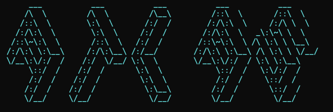

<div align="center">

#  ATLAS GUARDRAILS - Stop the Entropy     

**Stop LLM agents from turning your codebase into a landfill.**

[](https://www.npmjs.com/package/atlas-guardrails)
[](https://github.com/marcusgoll/atlas-guardrails/actions)
[](LICENSE)
[](https://www.npmjs.com/package/atlas-guardrails)




[Quick Start](#installation--integration-) •
[Features](#features) •
[MCP Support](#mcp-support) •
[Contributing](#contributing)

</div>

---

## The Problem

Coding agents (Claude Code, Cursor, Windsurf) are fast, but they have the memory of a goldfish. They:
1.  **Re-invent the wheel**: Creating `utils/date.ts` when `lib/time.ts` already exists.
2.  **Hallucinate APIs**: Guessing method signatures instead of looking them up.
3.  **Drift APIs**: Changing public exports without you realizing it until CI explodes.

## The Solution: Atlas

Atlas is a **local-first guardrail** that forces agents to "read the map" before they write code. It indexes your repo, packs relevant context deterministically, and screams at agents when they try to duplicate code or break APIs.

## Installation & Integration 🤖

Atlas is built for **AI Agents**, not humans. To give your agent "eyes" into your repository, choose your client below:

<details>
<summary><b>Gemini CLI</b></summary>

Install Atlas as a native extension:
```bash
gemini extensions install https://github.com/marcusgoll/atlas-guardrails
```

**If installation fails**, add it as a manual MCP extension:
```bash
gemini mcp add atlas -- command npx -y atlas-guardrails mcp
```
**Capabilities added:** `atlas_index`, `atlas_pack`, `atlas_find_duplicates`.
</details>

<details>
<summary><b>Claude Code</b></summary>

**Option A**: Add as marketplace + install plugin:
```bash
# In Claude Code:
/plugin marketplace add marcusgoll/atlas-guardrails
/plugin install atlas-guardrails@marcusgoll/atlas-guardrails
```

**Option B**: Add MCP server directly:
```bash
claude mcp add atlas -- npx -y atlas-guardrails mcp
```

**What you get:**
- MCP tools: `atlas_index`, `atlas_pack`, `atlas_find_duplicates`
- Slash commands: `/atlas-pack`, `/atlas-check`, `/atlas-duplicates`
</details>

<details>
<summary><b>Cursor / Windsurf</b></summary>

**Option A**: Copy the config file (recommended):
```bash
# From atlas-guardrails repo or create manually
cp .cursor/mcp.json ~/.cursor/mcp.json
```

**Option B**: Add via IDE settings:
1. Open **Settings** -> **Features** -> **MCP**.
2. Click **+ Add Server**:
   - **Name**: `Atlas`
   - **Type**: `command`
   - **Command**: `npx -y atlas-guardrails mcp`
</details>

<details>
<summary><b>Claude Desktop</b></summary>

Add Atlas to your `claude_desktop_config.json`:

```json
{
  "mcpServers": {
    "atlas": {
      "command": "npx",
      "args": ["-y", "atlas-guardrails", "mcp"]
    }
  }
}
```
</details>

<details>
<summary><b>Developer / Standalone CLI</b></summary>

To use Atlas as a standalone terminal tool (or to enable the global `atlas` command):
```bash
npm install -g atlas-guardrails
```
*Note: If you are on a version < 1.0.15, run this one last time to enable auto-updates.*

Keep Atlas current with:
```bash
atlas update
```
</details>

---

## Agent Workflow

Once installed, your AI agent will follow this deterministic loop:

1.  **Map the Terrain**: Agent calls `atlas_index` to build/update the symbol graph.
2.  **Gather Context**: Agent calls `atlas_pack` with your task description. It receives a token-optimized pack of relevant files and their dependency trails.
3.  **Prevent Duplication**: Before the agent writes a new helper, it calls `atlas_find_duplicates` to see if the code already exists.
4.  **Enforce Guardrails**: Agent runs `atlas check` (or you run it in CI) to ensure no public API drift occurred.

---

## Agent Instruction Files

To ensure your AI agent uses Atlas correctly, add an instruction file to your project root. The agent reads this file automatically and follows the guardrails.

| Client | File | Notes |
|--------|------|-------|
| Claude Code | `CLAUDE.md` | Auto-loaded by Claude |
| Gemini CLI | `GEMINI.md` | Referenced via `gemini-extension.json` |
| Generic | `AGENTS.md` | Works with most agents |

### Quick Setup

Copy the template to your project:

```bash
# For Claude Code
curl -o CLAUDE.md https://raw.githubusercontent.com/marcusgoll/atlas-guardrails/master/CLAUDE.md

# For Gemini CLI
curl -o GEMINI.md https://raw.githubusercontent.com/marcusgoll/atlas-guardrails/master/GEMINI.md
```

### Template Content

Your instruction file should include these core rules:

```markdown
# Atlas Guardrails

## Rules for Agent

1. **Pack Before Editing**: Run `atlas_pack(task="...")` before modifying code.
2. **Search Before Creating**: Run `atlas_find_duplicates(intent="...")` before creating new utilities.
3. **Respect Guardrails**: If `atlas check` fails, fix the drift.

## MCP Tools

- `atlas_index()` - Rebuild the symbol index
- `atlas_pack(task, budget)` - Get context for a task
- `atlas_find_duplicates(intent)` - Find existing code
```

### Why This Matters

Without instruction files, agents will:
- Skip the `atlas_pack` step and read random files
- Create duplicate utilities instead of reusing existing code
- Ignore API drift warnings

The instruction file makes Atlas usage **mandatory** for the agent.

---

## Documentation & Specs

*   [INTEGRATION.md](./INTEGRATION.md) - Full MCP & API Schema.
*   [CLAUDE.md](./CLAUDE.md) - Instruction set for Claude.
*   [GEMINI.md](./GEMINI.md) - Instruction set for Gemini.
*   [API Documentation](./docs/index.html) - TypeDoc output.

## Contributing

We aim for **>80% test coverage** to keep the guardrails stable.
1. Fork & Clone.
2. `npm install`
3. `npm test`
4. PR.

## License

MIT © [Marcus Gollahon](https://github.com/marcusgoll)
